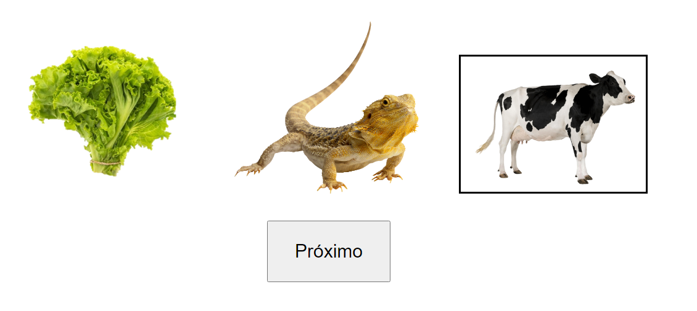

# psicologiaufscar
Projeto de pesquisa - Aprendizado de inglês para crianças - Teste de Comportamento de Ouvinte.

Aplicação web que simula um teste de "tato" utilizado para avaliar a eficácia do aprendizado de língua inglesa em crianças.

O teste consiste em apresentar três cartões com imagens (estímulos) para a criança e solicitar que aponte para a imagem que representa a palavra solicitada pela aplicadora do teste.

No exemplo abaixo, a aplicadora solicita: "Aponte cow." Então a criança clica no item que julgar correto e essa opção fica destacada.

Este projeto está implementado no github Pages: https://brunovaletta.github.io/psicologiaufscar/

A aplicação está sendo usada em uma pesquisa do Departamento de Psicologia da UFSCar como forma de manter os testes com os participantes durante a pandemia COVID-19.

O design simples faz parte dos requisitos da pesquisa, pois nenhum tipo de poluição visual ou elemento 'reforçador' deve influenciar na resposta do participante.

Desenvolvi o projeto quando ainda estava começando a aprender Javascript, então ainda possui uma estrutura muito básica e não muito eficiente, e necessita refatoração. 

Como está funcional e ainda sendo utilizado, optei por não refatorar.
